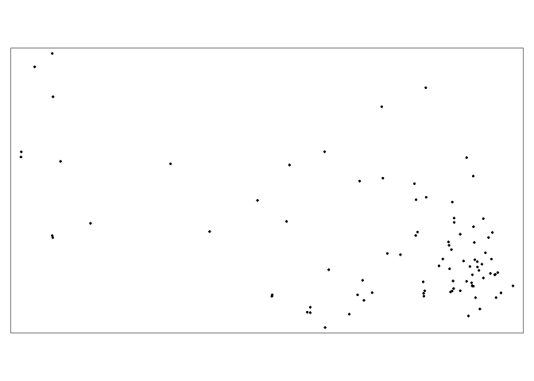

Data Cleaning
================
Vanessa Dinh

``` r
library(tidyverse)
```

    ## ── Attaching packages ─────────────────────────────────────── tidyverse 1.3.2 ──
    ## ✔ ggplot2 3.3.6     ✔ purrr   0.3.4
    ## ✔ tibble  3.1.8     ✔ dplyr   1.0.9
    ## ✔ tidyr   1.2.0     ✔ stringr 1.4.1
    ## ✔ readr   2.1.2     ✔ forcats 0.5.2
    ## ── Conflicts ────────────────────────────────────────── tidyverse_conflicts() ──
    ## ✖ dplyr::filter() masks stats::filter()
    ## ✖ dplyr::lag()    masks stats::lag()

``` r
library(sf)
```

    ## Linking to GEOS 3.9.1, GDAL 3.4.3, PROJ 7.2.1; sf_use_s2() is TRUE

``` r
library(tmap)
library(tmaptools)
```

``` r
health_outcomes = 
  read_csv("./data/PLACES_County_2022.csv") %>% 
  janitor::clean_names() %>% 
  select(-state_abbr, -state_desc) %>% 
  rename(county = county_name) %>% 
  mutate(
    county = as.factor(county)
  ) %>% 
  select(county, county_fips, total_population, starts_with("access2"), starts_with("binge"), starts_with("cancer"), starts_with("casthma"), starts_with("smoking"), starts_with("depression"), starts_with("lpa"), starts_with("mhlth"), starts_with("obesity"), geolocation
  )
```

    ## Rows: 3143 Columns: 126
    ## ── Column specification ────────────────────────────────────────────────────────
    ## Delimiter: ","
    ## chr (65): StateAbbr, StateDesc, CountyName, CountyFIPS, ACCESS2_Crude95CI, A...
    ## dbl (61): TotalPopulation, ACCESS2_CrudePrev, ACCESS2_AdjPrev, ARTHRITIS_Cru...
    ## 
    ## ℹ Use `spec()` to retrieve the full column specification for this data.
    ## ℹ Specify the column types or set `show_col_types = FALSE` to quiet this message.

``` r
str(health_outcomes)
```

    ## tibble [3,143 × 36] (S3: tbl_df/tbl/data.frame)
    ##  $ county               : Factor w/ 1840 levels "Abbeville","Acadia",..: 877 1295 789 940 99 37 1496 1099 212 232 ...
    ##  $ county_fips          : chr [1:3143] "45055" "45077" "40063" "17099" ...
    ##  $ total_population     : num [1:3143] 67472 127983 13126 107571 4358 ...
    ##  $ access2_crude_prev   : num [1:3143] 16.8 15.8 20.7 12.3 15.2 14.1 19.6 10.5 11 14.1 ...
    ##  $ access2_crude95ci    : chr [1:3143] "(14.5, 19.3)" "(12.9, 19.6)" "(18.1, 23.4)" "(10.3, 14.4)" ...
    ##  $ access2_adj_prev     : num [1:3143] 17.6 16.1 21.1 13 16.2 14.1 20.3 11.1 11.6 14.9 ...
    ##  $ access2_adj95ci      : chr [1:3143] "(15.2, 20.3)" "(13.3, 19.8)" "(18.4, 24.0)" "(10.9, 15.1)" ...
    ##  $ binge_crude_prev     : num [1:3143] 16 18.6 12.4 14.7 14.5 20 12.1 11.6 18.3 18.9 ...
    ##  $ binge_crude95ci      : chr [1:3143] "(15.4, 16.6)" "(17.7, 19.5)" "(11.9, 12.9)" "(14.0, 15.3)" ...
    ##  $ binge_adj_prev       : num [1:3143] 18.1 19.2 13.6 16.7 17.9 19.7 13.6 13.6 21.4 23.3 ...
    ##  $ binge_adj95ci        : chr [1:3143] "(17.4, 18.8)" "(18.4, 20.1)" "(13.0, 14.2)" "(15.9, 17.4)" ...
    ##  $ cancer_crude_prev    : num [1:3143] 7.4 6.7 7.3 7.6 8.8 5.7 7.7 8.1 8.2 9 ...
    ##  $ cancer_crude95ci     : chr [1:3143] "( 7.1,  7.8)" "( 6.3,  7.0)" "( 7.0,  7.6)" "( 7.2,  8.1)" ...
    ##  $ cancer_adj_prev      : num [1:3143] 5.9 6.1 6 5.9 6 5.8 6.2 6 6.1 6.1 ...
    ##  $ cancer_adj95ci       : chr [1:3143] "( 5.6,  6.1)" "( 5.8,  6.4)" "( 5.7,  6.2)" "( 5.6,  6.3)" ...
    ##  $ casthma_crude_prev   : num [1:3143] 10.1 10 11.4 9.6 9.7 9.2 11.8 10.8 8.7 8.4 ...
    ##  $ casthma_crude95ci    : chr [1:3143] "( 9.7, 10.6)" "( 9.5, 10.7)" "(11.0, 11.9)" "( 9.1, 10.2)" ...
    ##  $ casthma_adj_prev     : num [1:3143] 10.2 10 11.5 9.7 10 9.2 12 10.9 8.9 8.7 ...
    ##  $ casthma_adj95ci      : chr [1:3143] "( 9.8, 10.7)" "( 9.5, 10.6)" "(11.1, 12.0)" "( 9.2, 10.3)" ...
    ##  $ depression_crude_prev: num [1:3143] 21.9 23.8 25.5 17.2 19.9 16.5 26.6 26.9 20.6 15.9 ...
    ##  $ depression_crude95ci : chr [1:3143] "(20.9, 22.9)" "(22.3, 25.4)" "(24.5, 26.6)" "(16.2, 18.3)" ...
    ##  $ depression_adj_prev  : num [1:3143] 22.6 24.1 26.1 17.8 21.4 16.3 27.5 28.2 21.7 17.3 ...
    ##  $ depression_adj95ci   : chr [1:3143] "(21.6, 23.8)" "(22.7, 25.5)" "(25.0, 27.2)" "(16.8, 19.0)" ...
    ##  $ lpa_crude_prev       : num [1:3143] 27.8 24.6 34.6 26 28.4 19.3 37.2 29 22.7 25.3 ...
    ##  $ lpa_crude95ci        : chr [1:3143] "(25.4, 30.1)" "(21.7, 27.2)" "(32.1, 37.1)" "(23.2, 28.7)" ...
    ##  $ lpa_adj_prev         : num [1:3143] 26.4 24.7 33.4 24.7 26.1 19.5 35.7 27.2 21.2 23 ...
    ##  $ lpa_adj95ci          : chr [1:3143] "(24.2, 28.7)" "(21.9, 27.4)" "(31.0, 35.9)" "(22.1, 27.2)" ...
    ##  $ mhlth_crude_prev     : num [1:3143] 14.6 15.5 17.7 12.5 13.6 11.7 18.3 17.1 12.7 11 ...
    ##  $ mhlth_crude95ci      : chr [1:3143] "(13.8, 15.5)" "(14.1, 16.8)" "(16.8, 18.6)" "(11.7, 13.4)" ...
    ##  $ mhlth_adj_prev       : num [1:3143] 15.7 15.7 18.5 13.5 15.5 11.6 19.6 18.7 13.9 12.6 ...
    ##  $ mhlth_adj95ci        : chr [1:3143] "(14.7, 16.7)" "(14.4, 16.8)" "(17.6, 19.5)" "(12.5, 14.5)" ...
    ##  $ obesity_crude_prev   : num [1:3143] 40.7 29.1 41.9 35.6 39.3 28.5 40.2 38.3 35.6 34.2 ...
    ##  $ obesity_crude95ci    : chr [1:3143] "(39.1, 42.2)" "(27.5, 30.5)" "(40.4, 43.3)" "(33.9, 37.4)" ...
    ##  $ obesity_adj_prev     : num [1:3143] 40.3 30.9 42.4 35.8 39.5 28.5 40.3 38.4 36.5 34.8 ...
    ##  $ obesity_adj95ci      : chr [1:3143] "(38.7, 41.9)" "(29.2, 32.5)" "(41.0, 43.8)" "(34.0, 37.5)" ...
    ##  $ geolocation          : chr [1:3143] "POINT (-80.5908847 34.3383561)" "POINT (-82.7233774 34.8853677)" "POINT (-96.2511829 35.0529339)" "POINT (-88.8859312 41.3433407)" ...

``` r
superfund_sites =
  read_csv("./data/superfund_NPL_sites.csv") %>% 
  janitor::clean_names() %>% 
  select(-region_id, -state, -construction_completion_number, -site_listing_narrative, -site_progress_profile, -ends_with("notice"), -restoration_fr_notice_jumper_page, -noid_date, -deletion_date) %>% 
  filter(status == "NPL Site")
```

    ## Rows: 126 Columns: 27
    ## ── Column specification ────────────────────────────────────────────────────────
    ## Delimiter: ","
    ## chr (18): Site Name, Site EPA ID, State, City, County, Status, Proposed Date...
    ## dbl  (8): Site Score, SEMS ID, Region ID, Latitude, Longitude, Construction ...
    ## lgl  (1): Restoration FR Notice Jumper Page
    ## 
    ## ℹ Use `spec()` to retrieve the full column specification for this data.
    ## ℹ Specify the column types or set `show_col_types = FALSE` to quiet this message.

``` r
sf_superfund = 
  st_as_sf(superfund_sites, coords = c("longitude", "latitude"), crs = 4269)

tm_shape(sf_superfund)+
  tm_dots()
```

<!-- -->

``` r
st_crs(sf_superfund)
```

    ## Coordinate Reference System:
    ##   User input: EPSG:4269 
    ##   wkt:
    ## GEOGCRS["NAD83",
    ##     DATUM["North American Datum 1983",
    ##         ELLIPSOID["GRS 1980",6378137,298.257222101,
    ##             LENGTHUNIT["metre",1]]],
    ##     PRIMEM["Greenwich",0,
    ##         ANGLEUNIT["degree",0.0174532925199433]],
    ##     CS[ellipsoidal,2],
    ##         AXIS["geodetic latitude (Lat)",north,
    ##             ORDER[1],
    ##             ANGLEUNIT["degree",0.0174532925199433]],
    ##         AXIS["geodetic longitude (Lon)",east,
    ##             ORDER[2],
    ##             ANGLEUNIT["degree",0.0174532925199433]],
    ##     USAGE[
    ##         SCOPE["Geodesy."],
    ##         AREA["North America - onshore and offshore: Canada - Alberta; British Columbia; Manitoba; New Brunswick; Newfoundland and Labrador; Northwest Territories; Nova Scotia; Nunavut; Ontario; Prince Edward Island; Quebec; Saskatchewan; Yukon. Puerto Rico. United States (USA) - Alabama; Alaska; Arizona; Arkansas; California; Colorado; Connecticut; Delaware; Florida; Georgia; Hawaii; Idaho; Illinois; Indiana; Iowa; Kansas; Kentucky; Louisiana; Maine; Maryland; Massachusetts; Michigan; Minnesota; Mississippi; Missouri; Montana; Nebraska; Nevada; New Hampshire; New Jersey; New Mexico; New York; North Carolina; North Dakota; Ohio; Oklahoma; Oregon; Pennsylvania; Rhode Island; South Carolina; South Dakota; Tennessee; Texas; Utah; Vermont; Virginia; Washington; West Virginia; Wisconsin; Wyoming. US Virgin Islands.  British Virgin Islands."],
    ##         BBOX[14.92,167.65,86.46,-47.74]],
    ##     ID["EPSG",4269]]

``` r
superfund_by_county =
  superfund_sites %>% 
  group_by(county) %>% 
  summarize(n_superfund = n()) %>% 
  mutate(
    county = as.factor(county)
  )
  
str(superfund_by_county)
```

    ## tibble [33 × 2] (S3: tbl_df/tbl/data.frame)
    ##  $ county     : Factor w/ 33 levels "Adams","Allegheny",..: 1 2 3 4 5 6 7 8 9 10 ...
    ##  $ n_superfund: int [1:33] 4 3 8 1 1 8 2 1 9 1 ...

``` r
pa_county =
  st_read("./data/PaCounty2022_11.shp") %>% 
  janitor::clean_names() %>% 
  rename(county = county_nam) %>% 
  mutate(
    county = str_to_title(county)
) %>% 
  select(county, fips_count, shape_leng, shape_area, geometry)
```

    ## Reading layer `PaCounty2022_11' from data source 
    ##   `C:\Users\Vanessa\Documents\Columbia MPH\Data Science I\Final Project\p8105_final_project\data\PaCounty2022_11.shp' 
    ##   using driver `ESRI Shapefile'
    ## Simple feature collection with 67 features and 25 fields
    ## Geometry type: MULTIPOLYGON
    ## Dimension:     XY
    ## Bounding box:  xmin: -80.51938 ymin: 39.71985 xmax: -74.68956 ymax: 42.26934
    ## Geodetic CRS:  NAD83

``` r
tm_shape(pa_county) +
  tm_polygons()
```

<!-- -->

``` r
only_data =
  left_join(health_outcomes, superfund_by_county, by = "county") %>% 
  mutate_at(vars("n_superfund"), ~replace(., is.na(.), 0))
pa_combined =
  left_join(pa_county, only_data, by = "county")
```

``` r
tm_shape(pa_county) +
  tm_polygons(col = "grey90",
              border.col = "white") + 
tm_shape(sf_superfund) +
  tm_dots(col = "brown",
          alpha = 1)
```

<!-- -->

``` r
tm_shape(pa_combined) +
  tm_polygons(col = "n_superfund",
              style = "jenks",
              n = 4,
              palette = "YlOrBr",
              border.col = "black",
              title = "Superfund Sites in PA")
```

<!-- -->
