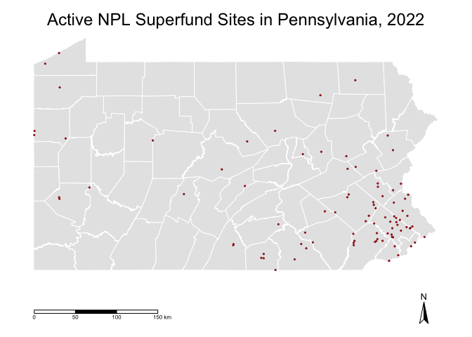

Maps
================
Vanessa Dinh

<!-- -->

``` r
# ggplotly(
# ggplot() +
#   geom_sf(data = pa_combined, lwd = 1) +
#    theme(axis.text.x = element_blank(),
#         axis.text.y = element_blank(),
#         axis.ticks = element_blank(),
#         rect = element_blank()) +
#   ggtitle("Active NPL Superfund Sites in Pennsylvania, 2022") +
#   theme(plot.title = element_text(hjust = 0.5, size = 18)) +
#   geom_polygon(col = "n_superfund",
#               style = "jenks",
#               n = 5,
#               palette = "YlOrBr",
#               border.col = "black",
#               title = "Superfund Sites") 
# )
```

<!-- -->
