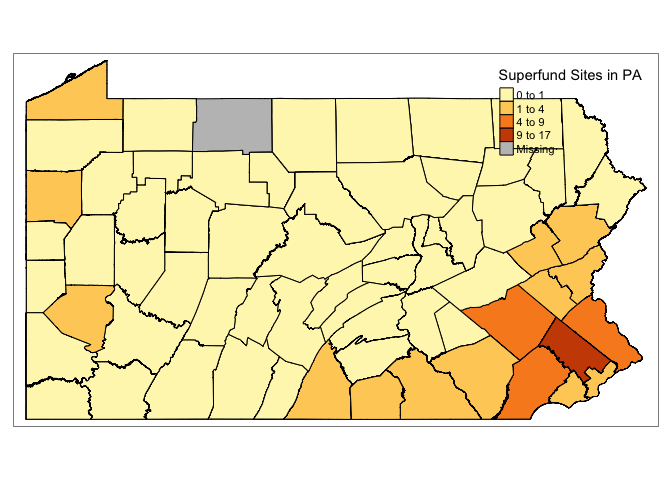

Data Cleaning
================
Vanessa Dinh

``` r
library(tidyverse)
```

    ## ── Attaching packages ─────────────────────────────────────── tidyverse 1.3.2 ──
    ## ✔ ggplot2 3.3.6     ✔ purrr   0.3.4
    ## ✔ tibble  3.1.8     ✔ dplyr   1.0.9
    ## ✔ tidyr   1.2.0     ✔ stringr 1.4.1
    ## ✔ readr   2.1.2     ✔ forcats 0.5.2
    ## ── Conflicts ────────────────────────────────────────── tidyverse_conflicts() ──
    ## ✖ dplyr::filter() masks stats::filter()
    ## ✖ dplyr::lag()    masks stats::lag()

``` r
library(sf)
```

    ## Linking to GEOS 3.9.1, GDAL 3.4.3, PROJ 7.2.1; sf_use_s2() is TRUE

``` r
library(tmap)
library(tmaptools)
```

``` r
health_outcomes = 
  read_csv("./data/PLACES_County_2022.csv") %>% 
  janitor::clean_names() %>% 
  select(-state_abbr, -state_desc) %>% 
  rename(county = county_name) %>% 
  mutate(
    county = as.factor(county)
  ) %>% 
  select(county, county_fips, total_population, starts_with("access2"), starts_with("binge"), starts_with("cancer"), starts_with("casthma"), starts_with("smoking"), starts_with("depression"), starts_with("lpa"), starts_with("mhlth"), starts_with("obesity"), geolocation
  )
```

    ## Rows: 67 Columns: 126
    ## ── Column specification ────────────────────────────────────────────────────────
    ## Delimiter: ","
    ## chr (64): StateAbbr, StateDesc, CountyName, ACCESS2_Crude95CI, ACCESS2_Adj95...
    ## dbl (61): CountyFIPS, ACCESS2_CrudePrev, ACCESS2_AdjPrev, ARTHRITIS_CrudePre...
    ## 
    ## ℹ Use `spec()` to retrieve the full column specification for this data.
    ## ℹ Specify the column types or set `show_col_types = FALSE` to quiet this message.

``` r
str(health_outcomes)
```

    ## tibble [67 × 36] (S3: tbl_df/tbl/data.frame)
    ##  $ county               : Factor w/ 67 levels "Adams","Allegheny",..: 51 62 19 36 6 65 4 38 25 30 ...
    ##  $ county_fips          : num [1:67] 42101 42123 42037 42071 42011 ...
    ##  $ total_population     : num [1:67] 1578487 38911 64842 546192 421017 ...
    ##  $ access2_crude_prev   : num [1:67] 14.6 10.4 10.7 12 14 8.9 9.6 13.2 11.2 11.6 ...
    ##  $ access2_crude95ci    : chr [1:67] "(12.7, 16.6)" "( 8.5, 12.4)" "( 8.5, 13.3)" "( 9.9, 14.2)" ...
    ##  $ access2_adj_prev     : num [1:67] 14.5 11.2 11.2 12.4 14.6 9.5 10.2 13.8 11.6 12.1 ...
    ##  $ access2_adj95ci      : chr [1:67] "(12.6, 16.4)" "( 9.0, 13.4)" "( 8.9, 13.9)" "(10.2, 14.7)" ...
    ##  $ binge_crude_prev     : num [1:67] 18.1 16.3 18.4 16.7 18 17.8 17.6 16.9 17.8 18.3 ...
    ##  $ binge_crude95ci      : chr [1:67] "(17.6, 18.6)" "(15.6, 17.0)" "(17.4, 19.2)" "(16.1, 17.4)" ...
    ##  $ binge_adj_prev       : num [1:67] 18 19.9 20.2 18.5 19.7 21.3 20.6 19.1 19.6 20.4 ...
    ##  $ binge_adj95ci        : chr [1:67] "(17.6, 18.5)" "(19.1, 20.9)" "(19.3, 21.2)" "(17.7, 19.3)" ...
    ##  $ cancer_crude_prev    : num [1:67] 5.5 8.7 7.4 7.5 7.1 8.5 8.3 7.6 7.4 7.6 ...
    ##  $ cancer_crude95ci     : chr [1:67] "( 5.3,  5.7)" "( 8.2,  9.2)" "( 7.0,  7.9)" "( 7.1,  7.9)" ...
    ##  $ cancer_adj_prev      : num [1:67] 5.4 6.1 6.1 6.1 5.9 6.1 6.1 5.9 6 6.1 ...
    ##  $ cancer_adj95ci       : chr [1:67] "( 5.2,  5.5)" "( 5.8,  6.5)" "( 5.8,  6.4)" "( 5.7,  6.4)" ...
    ##  $ casthma_crude_prev   : num [1:67] 11.9 10 10.4 10.1 9.9 9.9 10 10 10.1 10.3 ...
    ##  $ casthma_crude95ci    : chr [1:67] "(11.5, 12.3)" "( 9.5, 10.6)" "( 9.9, 11.1)" "( 9.5, 10.6)" ...
    ##  $ casthma_adj_prev     : num [1:67] 11.9 10.2 10.5 10.2 10 10.1 10.2 10.2 10.2 10.4 ...
    ##  $ casthma_adj95ci      : chr [1:67] "(11.5, 12.4)" "( 9.7, 10.8)" "( 9.9, 11.1)" "( 9.6, 10.8)" ...
    ##  $ depression_crude_prev: num [1:67] 20.7 21.8 22 21.6 20.8 21.3 21 21.6 21.8 22.6 ...
    ##  $ depression_crude95ci : chr [1:67] "(19.9, 21.5)" "(20.6, 23.0)" "(20.7, 23.4)" "(20.3, 23.0)" ...
    ##  $ depression_adj_prev  : num [1:67] 20.5 23.3 22.6 22.3 21.2 22.6 22 22.4 22.4 23.2 ...
    ##  $ depression_adj95ci   : chr [1:67] "(19.7, 21.4)" "(21.9, 24.7)" "(21.3, 24.0)" "(20.9, 23.8)" ...
    ##  $ lpa_crude_prev       : num [1:67] 29.7 26.7 23.7 23.5 26 23.1 23.7 26.6 24.1 25.7 ...
    ##  $ lpa_crude95ci        : chr [1:67] "(27.4, 31.8)" "(23.8, 29.6)" "(21.0, 26.5)" "(20.8, 26.1)" ...
    ##  $ lpa_adj_prev         : num [1:67] 29.7 24.4 23 22.5 25.1 21.2 21.9 25.3 23.1 24.5 ...
    ##  $ lpa_adj95ci          : chr [1:67] "(27.5, 31.9)" "(21.6, 27.1)" "(20.3, 25.5)" "(19.8, 25.1)" ...
    ##  $ mhlth_crude_prev     : num [1:67] 16.9 14.9 15.7 14.9 15 14 14.5 15.1 15.4 15.8 ...
    ##  $ mhlth_crude95ci      : chr [1:67] "(16.0, 17.8)" "(13.9, 15.9)" "(14.5, 17.0)" "(13.7, 16.1)" ...
    ##  $ mhlth_adj_prev       : num [1:67] 16.9 16.8 16.4 15.8 15.7 15.6 15.9 16.2 16.3 16.8 ...
    ##  $ mhlth_adj95ci        : chr [1:67] "(16.0, 17.8)" "(15.5, 18.0)" "(15.2, 17.7)" "(14.5, 17.2)" ...
    ##  $ obesity_crude_prev   : num [1:67] 30.2 35.1 33.4 33.4 36.9 34.8 34.4 36 37.7 36.3 ...
    ##  $ obesity_crude95ci    : chr [1:67] "(29.3, 31.1)" "(33.2, 37.1)" "(31.6, 35.1)" "(31.7, 34.9)" ...
    ##  $ obesity_adj_prev     : num [1:67] 30.5 35 34.7 33.8 37.3 34.8 34.5 36.3 38.1 36.4 ...
    ##  $ obesity_adj95ci      : chr [1:67] "(29.6, 31.4)" "(33.0, 37.1)" "(32.8, 36.7)" "(32.1, 35.3)" ...
    ##  $ geolocation          : chr [1:67] "POINT (-75.1333459 40.0093755)" "POINT (-79.2981823 41.8342984)" "POINT (-76.4042599 41.0455174)" "POINT (-76.250198 40.0419921)" ...

``` r
superfund_sites =
  read_csv("./data/superfund_NPL_sites.csv") %>% 
  janitor::clean_names() %>% 
  select(-region_id, -state, -construction_completion_number, -site_listing_narrative, -site_progress_profile, -ends_with("notice"), -restoration_fr_notice_jumper_page, -noid_date, -deletion_date) %>% 
  filter(status == "NPL Site")
```

    ## Rows: 126 Columns: 27
    ## ── Column specification ────────────────────────────────────────────────────────
    ## Delimiter: ","
    ## chr (18): Site Name, Site EPA ID, State, City, County, Status, Proposed Date...
    ## dbl  (8): Site Score, SEMS ID, Region ID, Latitude, Longitude, Construction ...
    ## lgl  (1): Restoration FR Notice Jumper Page
    ## 
    ## ℹ Use `spec()` to retrieve the full column specification for this data.
    ## ℹ Specify the column types or set `show_col_types = FALSE` to quiet this message.

``` r
sf_superfund = 
  st_as_sf(superfund_sites, coords = c("longitude", "latitude"), crs = 4269)

tm_shape(sf_superfund)+
  tm_dots()
```

<!-- -->

``` r
st_crs(sf_superfund)
```

    ## Coordinate Reference System:
    ##   User input: EPSG:4269 
    ##   wkt:
    ## GEOGCRS["NAD83",
    ##     DATUM["North American Datum 1983",
    ##         ELLIPSOID["GRS 1980",6378137,298.257222101,
    ##             LENGTHUNIT["metre",1]]],
    ##     PRIMEM["Greenwich",0,
    ##         ANGLEUNIT["degree",0.0174532925199433]],
    ##     CS[ellipsoidal,2],
    ##         AXIS["geodetic latitude (Lat)",north,
    ##             ORDER[1],
    ##             ANGLEUNIT["degree",0.0174532925199433]],
    ##         AXIS["geodetic longitude (Lon)",east,
    ##             ORDER[2],
    ##             ANGLEUNIT["degree",0.0174532925199433]],
    ##     USAGE[
    ##         SCOPE["Geodesy."],
    ##         AREA["North America - onshore and offshore: Canada - Alberta; British Columbia; Manitoba; New Brunswick; Newfoundland and Labrador; Northwest Territories; Nova Scotia; Nunavut; Ontario; Prince Edward Island; Quebec; Saskatchewan; Yukon. Puerto Rico. United States (USA) - Alabama; Alaska; Arizona; Arkansas; California; Colorado; Connecticut; Delaware; Florida; Georgia; Hawaii; Idaho; Illinois; Indiana; Iowa; Kansas; Kentucky; Louisiana; Maine; Maryland; Massachusetts; Michigan; Minnesota; Mississippi; Missouri; Montana; Nebraska; Nevada; New Hampshire; New Jersey; New Mexico; New York; North Carolina; North Dakota; Ohio; Oklahoma; Oregon; Pennsylvania; Rhode Island; South Carolina; South Dakota; Tennessee; Texas; Utah; Vermont; Virginia; Washington; West Virginia; Wisconsin; Wyoming. US Virgin Islands.  British Virgin Islands."],
    ##         BBOX[14.92,167.65,86.46,-47.74]],
    ##     ID["EPSG",4269]]

``` r
superfund_by_county =
  superfund_sites %>% 
  group_by(county) %>% 
  summarize(n_superfund = n()) %>% 
  mutate(
    county = as.factor(county)
  )
  
str(superfund_by_county)
```

    ## tibble [33 × 2] (S3: tbl_df/tbl/data.frame)
    ##  $ county     : Factor w/ 33 levels "Adams","Allegheny",..: 1 2 3 4 5 6 7 8 9 10 ...
    ##  $ n_superfund: int [1:33] 4 3 8 1 1 8 2 1 9 1 ...

``` r
pa_county =
  st_read("./data/PaCounty2022_11.shp") %>% 
  janitor::clean_names() %>% 
  rename(county = county_nam) %>% 
  mutate(
    county = str_to_title(county)
) %>% 
  select(county, fips_count, shape_leng, shape_area, geometry)
```

    ## Reading layer `PaCounty2022_11' from data source 
    ##   `C:\Users\Vanessa\Documents\Columbia MPH\Data Science I\Final Project\p8105_final_project\data\PaCounty2022_11.shp' 
    ##   using driver `ESRI Shapefile'
    ## Simple feature collection with 67 features and 25 fields
    ## Geometry type: MULTIPOLYGON
    ## Dimension:     XY
    ## Bounding box:  xmin: -80.51938 ymin: 39.71985 xmax: -74.68956 ymax: 42.26934
    ## Geodetic CRS:  NAD83

``` r
tm_shape(pa_county) +
  tm_polygons()
```

<!-- -->

``` r
only_data =
  left_join(health_outcomes, superfund_by_county, by = "county") %>% 
  mutate_at(vars("n_superfund"), ~replace(., is.na(.), 0))

pa_combined =
  left_join(pa_county, only_data, by = "county")
```

``` r
tm_shape(pa_county) +
  tm_polygons(col = "grey90",
              border.col = "white") + 
tm_shape(sf_superfund) +
  tm_dots(col = "brown",
          alpha = 1)
```

<!-- -->

``` r
tm_shape(pa_combined) +
  tm_polygons(col = "n_superfund",
              style = "jenks",
              n = 4,
              palette = "YlOrBr",
              border.col = "black",
              title = "Superfund Sites in PA")
```

<!-- -->
