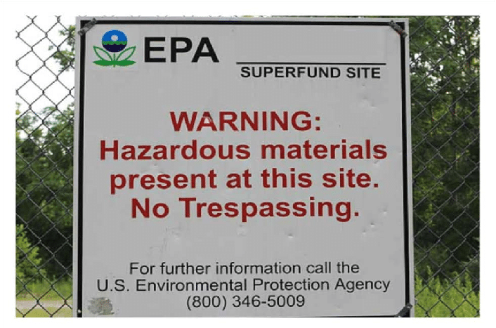

 

<p align="left">

<iframe width="560" height="315" src="https://www.youtube.com/embed/0HJo-mKRAs0" title="YouTube video player" frameborder="0" allow="accelerometer; autoplay; clipboard-write; encrypted-media; gyroscope; picture-in-picture" allowfullscreen></iframe>



</p>

 

```{=html}
<style type="text/css">
</style>
```
## Motivation

The motivation for this website stems from the fact that Superfund sites are areas designated by the EPA that are contaminated with hazardous or toxic substances and have potential to release these substances into the environment, adversely affecting human health. Thus, our group wanted to evaluate the health effects of living in proximity to a Superfund site, as [1 in 6 Americans](https://housingmatters.urban.org/articles/millions-americans-live-near-toxic-waste-sites-how-does-affect-their-health) currently live near a Superfund site. In particular, we are interested in the effects residing in a county with Superfund site on asthma and cancer outcomes, since risk for those two diseases can be influenced by environmental exposures.

 

## Initial Questions

1.  Does living in a county with a Superfund increase risk for cancer?
2.  Does living in a county with a Superfund increase risk for asthma?
3.  Does county level Superfund site score affect both cancer and asthma outcomes?
4.  What is the geographic spread of Superfund sites in Pennsylvania?

 

## Website Overview

Data for this website was acquired from the CDC and EPA specifically for Superfund site locations and health outcomes.

**In the Exploratory Analysis tab, you will be able to access:**

<ul>

<li>Analyses of the location, number, and site scores of Superfund sites in the state of Pennsylvania</li>

<li>Analyses of health outcomes for our main health outcomes (cancer & asthma) and our predictor variables (lack of health insurance, mean site score, smoking prevalence, and depression prevalence).</li>

</ul>

**In the Regression Analyses tab, you will find:**

<ul>

<li>Poisson Regression Model with log link function investigating associations between asthma and cancer case count and county, while controlling for smoking prevalence, prevalence of lack of health insurance, depression prevalence, and the average Superfund site score by county.</li>

</ul>

**In the Interactive Maps tab, there are:**

<ul>

<li>Interactive maps depicting the prevalences of our main health outcomes (cancer & smoking) in relation to geographic locations of current NPL Superfund sites in Pennsylvania, mapped by county.</li>

</ul>

**In the Report tab, we have compiled:**

<ul>

<li>A complete report of the data, exploratory analyses, and regression analyses with code, tables, graphs, and other figures to investigate the association between location of Superfund sites and the main health outcomes of interest: asthma and cancer in Pennsylvania.</li>

</ul>

   

### Collaborators:

<ul>

<li>[Mindy Tran](https://mindytran96.github.io/)</li>

<li>[Rahul Hosalli](https://r-hosalli.github.io/)</li>

<li>[Armaan Sodhi](https://as6447.github.io/)</li>

<li>[Vanessa Dinh](https://vd24071.github.io/)</li>

</ul>
